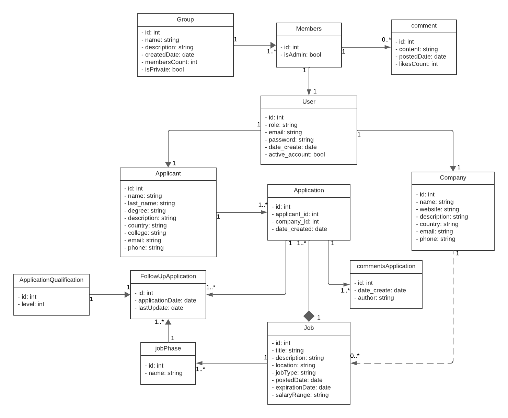

## WorkConnect - JobHub

**WorkConnect** es una start-up conformada por estudiantes de la Universidad Peruana de Ciencias Aplicadas (UPC) que surgió con la iniciativa de ofrecer una mejor alternativa para la búsqueda de empleos en el mundo laboral actual. La empresa ha creado una conexión más cercana entre empleados y empleadores, ofreciendo un servicio accesible tanto para profesionales como para empleadores.

## JobHub
**JobHub** es el producto principal de WorkConnect, un servicio diseñado para mejorar las relaciones profesionales en diversos campos laborales, facilitando el proceso de búsqueda de empleo y creación de redes de contactos.

### Colaboradores del Proyecto

| **Nombre**                    | **Rol**                                     | **Perfil**                                                 |
|-------------------------------|---------------------------------------------|------------------------------------------------------------|
| Bravo Ricapa Leonardo Leoncio | Líder del Proyecto | [LinkedIn](https://www.linkedin.com/in/leonardo-bravo-4120b8228/)           |

### Revisa el Progreso del Proyecto JobHub

| **Columna**    | **Descripción**                                                                                                                                    |
|----------------|----------------------------------------------------------------------------------------------------------------------------------------------------|
| **Backlog**    | Contiene todas las historias de usuario, tareas y características que deben desarrollarse. Es el listado de todo el trabajo pendiente.              |
| **In Process** | Incluye las tareas que están actualmente en desarrollo. Visualiza el trabajo en curso para asegurar el flujo continuo de trabajo.                   |
| **In Review**  | Después de completar una tarea, se mueve aquí para una revisión de código y revisión por pares (peer review). Esta fase incluye la creación de **pull requests** para asegurar que el código cumpla con los estándares de calidad antes de integrarse al proyecto principal. |
| **Done**       | Las tareas completamente desarrolladas, revisadas y probadas se mueven aquí, indicando que están listas y finalizadas.                               |

Mira cómo va avanzando nuestro trabajo visitando el siguiente enlace: [Tablero de Trello](https://trello.com/b/sQPae7xi/jobhub).

## Diagramas de la Aplicación

Para entender mejor la estructura y diseño de la aplicación "JobHub", revisa los siguientes diagramas:

### Diagrama de Clases

### Diagrama de Base de Datos

Este diagrama ilustra el esquema de la base de datos utilizada por la aplicación, mostrando las tablas, columnas, y relaciones entre las entidades.

### Descripción de Capas del Proyecto

| Capa         | descripción                                                                                  |
|--------------|----------------------------------------------------------------------------------------------|
| Controller   | 	Contiene los controladores REST responsables de gestionar las solicitudes HTTP y devolver las respuestas correspondientes. |
| Entity       | 	Define las clases del modelo de datos que están vinculadas a las tablas de la base de datos. |
| Repository   | Proporciona la interfaz para realizar operaciones CRUD y conectarse con la base de datos.  |
| Service      | Contiene la lógica de negocio y define las operaciones que se ejecutan sobre las entidades.  |
| Service impl | Implementa la lógica de negocio descrita en los servicios, utilizando los repositorios necesarios para ello. |